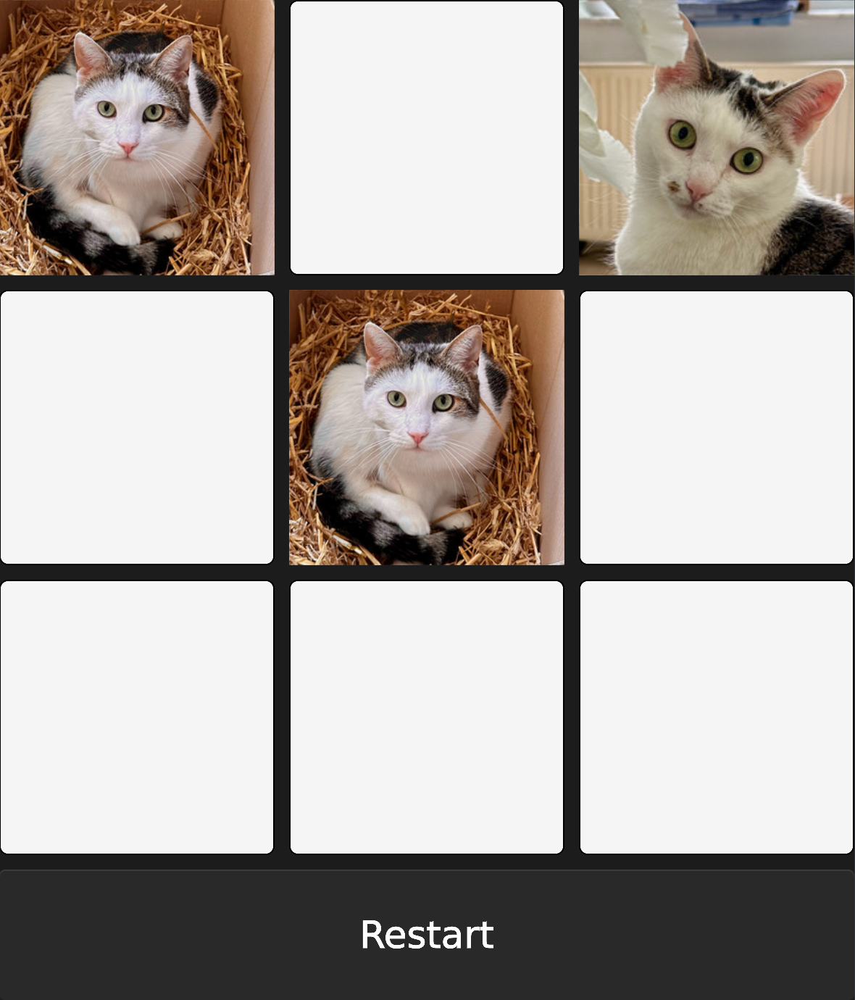

### Tic Tac Toe against the computer

This projects implements the Monte Carlo Tree Search (MCTS) algorithm for the game Tic Tac Toe so you can play it against the computer via a graphical user interface (GUI)
or a command line interface (CLI). The [algorithm](https://en.wikipedia.org/wiki/Monte_Carlo_tree_search) and the game logic are implemented in
[Rust](https://www.rust-lang.org/). The graphical user interface is compiled to [Web Assembly](https://webassembly.org/) and built with [slint](https://slint.dev/).

#### Highlights

Some aspects of this project are more complicated than necessary, so I could learn about applying them in practice. These highlights of the implementation include:

- Generic implementation of the MCTS algorithm which is made available as a trait. As such, this implementation can be reused for all kind of other turn based games
without needing to touch the algorithm.
- Use of cargo workspace to have completely seperate projects for the game logic, the algorithm and the two user interfaces (GUI and CLI).
- Use of arena allocator for implementing the tree structure required for the MCTS algorithm to avoid self-referential data structures.
- A replacement of `X` and `O` with the cats Emma and Julius in the GUI version.

#### Limitations

- The implementation is a naive version of MCTS using the UCB1 score. The decisions quality of the algorithm could certainly be better.
- The algorithm does not exploit symmetry in the game states (i.e. mirrored board states are treated separately).
- The algorithm does not reuse the lower tree body after each move (i.e. a new tree is created every time a move from the computer is requested).

#### Instructions

You can simply play the game on my website https://dumbdurian.com/pages/tictactoe/

Or if you have used Rust before you can use cargo to compile the game from source and run it locally 
using `cargo run --bin gui` or `cargo run --bin cli` for the graphical user interface or the command line interface respectively.

#### Preview

